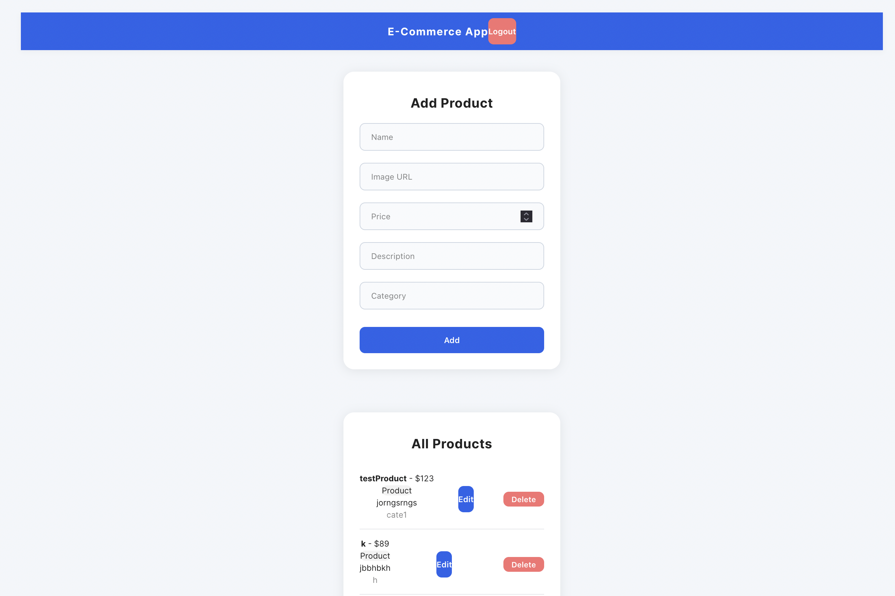

# E-Commerce Full Stack App

A modern, full-stack e-commerce application with Node.js/Express backend and React/Vite frontend. Features authentication, product and cart CRUD, admin dashboard, role-based access, and a polished, responsive UI/UX.

---

## 🚀 Live Demo

[Live Demo (Frontend on Vercel)](https://e-commerce-backend-focused.vercel.app/)

[Live Demo (Backend API on Render)](https://e-commerce-backend-focused.onrender.com/)


---

## 📸 Screenshots

| Home / Product List | Cart Modal | Admin Dashboard |
|--------------------|------------|-----------------|
|  |  |  |

*Add your screenshots to a `screenshots/` folder in the repo.*

---

## Features
- User registration & login (JWT authentication)
- Role-based access (admin & user)
- Product CRUD (admin only)
- Cart CRUD (per user, synced with backend)
- Admin dashboard for product management
- Responsive, modern UI (desktop & mobile)
- Loading spinners & error handling
- Modal-based cart and forms

---

## Tech Stack
- **Frontend:** React, Vite, CSS
- **Backend:** Node.js, Express, MongoDB, JWT

---

## Getting Started

### Backend
1. Clone the repo:
   ```bash
   git clone https://github.com/Sanchit029/E-Commerce-Backend_Focused.git
   cd E-Commerce-Backend_Focused
   ```
2. Install dependencies:
   ```bash
   npm install
   ```
3. Create a `.env` file:
   ```env
   MONGODB_URI=your_mongodb_uri
   JWT_SECRET=your_jwt_secret
   PORT=5001
   ```
4. Start the server:
   ```bash
   node server.js
   ```

### Frontend
1. Go to the frontend directory:
   ```bash
   cd ecom-frontend
   ```
2. Install dependencies:
   ```bash
   npm install
   ```
3. Create a `.env` file:
   ```env
   VITE_API_URL=https://your-backend-url.onrender.com
   ```
4. Start the frontend:
   ```bash
   npm run dev
   ```

---

## License

MIT
